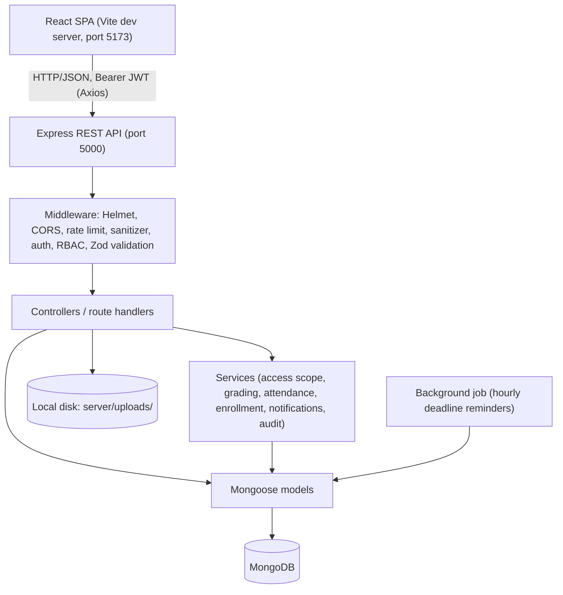
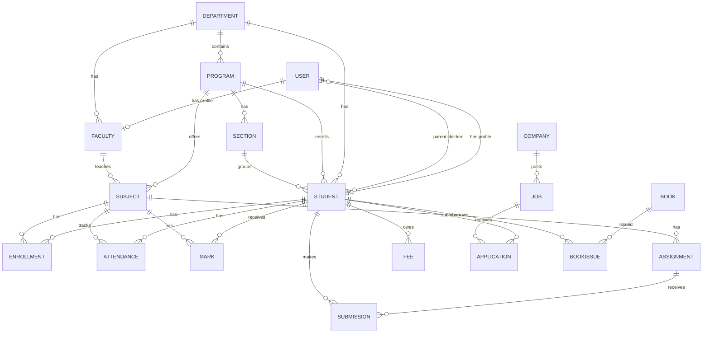

# Student Management System

**Project Documentation**

| | |
|---|---|
| Project type | Full-stack web application (MERN stack) |
| Package name | `student-management-system` (v1.0.0) |
| Components | `client/` (React single-page app), `server/` (Node.js / Express REST API) |
| Database | MongoDB, accessed through Mongoose |

---

## Table of Contents

1. [Project Overview](#1-project-overview)
2. [Project Objectives](#2-project-objectives)
3. [Problem Statement](#3-problem-statement)
4. [Proposed Solution](#4-proposed-solution)
5. [Technology Stack](#5-technology-stack)
6. [System Architecture](#6-system-architecture)
7. [User Roles and Access Control](#7-user-roles-and-access-control)
8. [Functional Modules](#8-functional-modules)
9. [Database Design](#9-database-design)
10. [Backend Design](#10-backend-design)
11. [REST API Overview](#11-rest-api-overview)
12. [Frontend Design](#12-frontend-design)
13. [Security Implementation](#13-security-implementation)
14. [Configuration](#14-configuration)
15. [Installation and Running the Project](#15-installation-and-running-the-project)
16. [Testing](#16-testing)
17. [Project Structure](#17-project-structure)
18. [Current Limitations](#18-current-limitations)
19. [Possible Future Enhancements](#19-possible-future-enhancements)
20. [Conclusion](#20-conclusion)

---

## 1. Project Overview

The Student Management System (SMS) is a web application that manages the academic records and day-to-day activities of a college in one place. It is built on the MERN stack: MongoDB, Express.js, React and Node.js.

The system has four kinds of users: **administrators, faculty, students and parents**. Each user signs in with an account and sees only the screens and data that belong to their role. Administrators configure the institution and manage people. Faculty record attendance and marks and run assignments. Students view their own academic information and submit work. Parents view the records of their linked children.

The application covers student and faculty records, academic structure (departments, programs, semesters, sections, subjects), attendance, marks and results, examinations, assignments, timetables, notices, documents, fees, library, placements and reports. It runs locally with Node.js and a MongoDB database. Uploaded files are stored on the server's local disk, and MongoDB stores only their metadata and relative path.

## 2. Project Objectives

The objectives below correspond to functionality that exists in the code.

1. **Centralize institutional records.** Keep student, faculty, department, program, subject and enrollment data in a single database.
2. **Provide role-based access.** Restrict every API route by role (admin, faculty, student, parent) and restrict the data returned to what each user is permitted to see.
3. **Digitize attendance.** Let faculty mark attendance per subject, section and date. Calculate attendance percentages and flag students below a configurable threshold (default 75%). Let students request corrections.
4. **Digitize marks and results.** Record marks by assessment type and calculate subject percentage, grade, SGPA and CGPA from an administrator-configurable grade scale.
5. **Support academic operations.** Schedule exams with room-conflict detection, maintain weekly timetables, and manage assignments with submissions and evaluation.
6. **Improve communication.** Publish notices targeted by department, program, year or section, deliver in-app notifications, and maintain an academic calendar.
7. **Support student services.** Provide document upload and verification, support tickets, achievements, fee tracking, a library module and a placement module.
8. **Provide administration tools.** Offer dashboards, reports (JSON, CSV, PDF), bulk student import from CSV, audit logs and configurable institution settings.
9. **Protect data.** Apply authentication, input validation, rate limiting, upload checks and audit logging.

## 3. Problem Statement

Colleges commonly manage academic information with paper registers, spreadsheets and separate tools. This leads to several problems:

- **Scattered records.** Student details, attendance sheets, mark lists and fee records are kept in different files and formats, and are hard to keep consistent.
- **Slow retrieval and reporting.** Producing an attendance shortage list or a department-wise student list takes manual collation.
- **Calculation errors.** Attendance percentages, grades, SGPA and CGPA calculated by hand are error-prone and applied inconsistently.
- **Limited visibility for students and parents.** Students and parents often learn about attendance shortages or results late.
- **Weak access control.** Shared spreadsheets cannot reliably limit who sees or edits which records.
- **Scheduling conflicts.** Clashes between rooms, faculty and sections in timetables and exam schedules are noticed late.
- **No audit trail.** It is difficult to establish who changed an attendance entry or mark, and when.

## 4. Proposed Solution

SMS replaces these separate tools with one web application backed by one database.

**Workflow as implemented:**

1. **Setup (administrator).** The administrator signs in, then creates departments, programs, academic years, semesters and sections, and then subjects. Faculty and student records are created individually or imported from a CSV file. Creating a student or faculty record also creates a login account with a random temporary password, shown once, which the user must change at first login.
2. **Enrollment.** Students are enrolled automatically in the non-elective subjects of their program and semester (respecting any section restriction on the subject). Enrollment is re-run when a student or subject is created, and an administrator can trigger a manual sync.
3. **Daily operation (faculty).** Faculty see only the subjects assigned to them. They mark attendance for a class, enter marks, create assignments and evaluate submissions, upload study materials and publish notices.
4. **Student and parent access.** Students and parents sign in to see a dashboard, attendance summaries with threshold warnings, results (grades, SGPA, CGPA), exams, timetable, notices and notifications. Students can also submit assignments, upload documents, raise support tickets, record achievements, view and pay fees (simulated) and apply for jobs.
5. **Administration.** The administrator reviews dashboards, generates reports, verifies documents, handles tickets, manages fees, library and placements, and inspects the audit log.
6. **Automatic notifications.** A background job runs hourly (first run 30 seconds after the server starts) and notifies enrolled students who have not yet submitted an assignment due within 24 hours. Other events, such as assignment creation, published exams and notices, also create in-app notifications.

## 5. Technology Stack

All technologies below are listed in the project's `package.json` files or are used directly in the source.

| Layer | Technology | Purpose |
|---|---|---|
| Frontend framework | React 18 (`react`, `react-dom`) | Single-page user interface |
| Frontend build tool | Vite 5 with `@vitejs/plugin-react` | Development server, hot reload and production build |
| Routing | React Router 6 (`react-router-dom`) | Client-side routing and role-protected routes |
| HTTP client | Axios | API calls, in-memory bearer token, silent session refresh through an httpOnly cookie |
| Charts | Recharts | Dashboard charts (line and bar) |
| Notifications (UI) | react-hot-toast | Toast messages |
| Styling | Plain CSS (`client/src/styles/index.css`) | Custom design system; no CSS framework |
| State management | React Context (`AuthContext`, `SettingsContext`) and custom hooks | Authentication and settings state; no Redux or similar library |
| Runtime | Node.js (ES modules) | Server runtime |
| Web framework | Express 4 | REST API |
| Database | MongoDB | Data storage |
| ODM | Mongoose 8 | Schemas, models and queries |
| Authentication | `jsonwebtoken` (JWT), `bcryptjs` | Access/refresh tokens and password hashing |
| Validation | Zod | Request body, query and parameter validation |
| File uploads | Multer | Multipart uploads to local disk |
| Security middleware | Helmet, CORS, `express-rate-limit`, custom input sanitizer | Security headers, origin control, rate limiting, NoSQL operator stripping |
| Logging | Morgan, custom file logger | HTTP request logs; errors appended to `server/src/logs/error.log` |
| PDF generation | PDFKit | PDF reports |
| CSV parsing | `csv-parse` | Bulk student import |
| Configuration | dotenv | Environment variables |
| Dev tooling (server) | `node --watch`, cross-env, ESLint, Prettier | Auto-restart in development; cross-platform env variables; linting and formatting for the whole repository |
| Server tests | Jest, Supertest, mongodb-memory-server | API integration tests |
| Client tests | Vitest, Testing Library (`react`, `jest-dom`, `user-event`), jsdom | Component, API-client, auth-flow and utility tests |
| End-to-end tests | Playwright, axe-core | Real-browser tests of the production build, including WCAG 2.1 A/AA accessibility scans |
| Deployment | Docker, Docker Compose, GitHub Actions | Container image, one-command stack with MongoDB, continuous integration |

## 6. System Architecture

The application is a three-tier, client–server system. The React app runs in the browser and communicates with the Express API over HTTP using JSON. The API reads and writes MongoDB through Mongoose. Uploaded files are written to a local folder (`server/uploads/`) and served back only through an authenticated API route.



**Request flow on the API:**

`Request → Helmet / CORS / body parsers → input sanitizer → rate limiter → route → protect (JWT check) → authorize (role) → validate (Zod) → controller → service / model → response`

Errors thrown anywhere are handled by a single error handler (`server/src/middleware/error.js`). It maps Zod, Mongoose, Multer, duplicate-key and JSON-parse errors to a consistent response, `{ success: false, message, errors? }`. Successful responses use `{ success: true, message, data, meta? }`.

**Development setup.** In development, the Vite server proxies requests beginning with `/api` to `http://localhost:5000` (configurable with `VITE_PROXY_TARGET`). In a production-style run, setting `SERVE_CLIENT=true` makes Express serve the built `client/dist` folder, so one server handles everything.

## 7. User Roles and Access Control

Four roles exist: `admin`, `faculty`, `student` and `parent`. Access is enforced in two places:

- **On the API.** The `protect` middleware verifies the JWT and loads the active user on every request. The `authorize(...roles)` middleware restricts each route to specific roles. Controllers and services additionally scope data by ownership: a student sees only their own records, a parent sees only linked children, and a faculty member sees only students enrolled in the subjects assigned to them.
- **In the UI.** `App.jsx` wraps routes in a `Protected` component that redirects unauthenticated users to the login page and shows an "Access denied" page for disallowed roles. The sidebar (`client/src/routes/nav.js`) shows only the entries allowed for the current role. The UI mirrors the API rules, which remain the authoritative check.

**Sidebar and page access by role** (taken from `client/src/routes/nav.js`):

| Page | Admin | Faculty | Student | Parent |
|---|:-:|:-:|:-:|:-:|
| Dashboard, Notices, Academic Calendar, Timetable, Attendance, Examinations, Support Tickets, Achievements | ✔ | ✔ | ✔ | ✔ |
| Students | ✔ | ✔ | | |
| My Children | | | | ✔ |
| Faculty, User Accounts, Academic Setup | ✔ | | | |
| Subjects | ✔ | ✔ | ✔ | |
| Marks Entry | ✔ | ✔ | | |
| Results | | | ✔ | ✔ |
| Assignments, Study Materials | ✔ | ✔ | ✔ | |
| Documents, Fees, Library | ✔ | | ✔ | ✔ |
| Placements | ✔ | | ✔ | |
| Reports | ✔ | ✔ | | |
| Bulk Import, Audit Logs, Settings | ✔ | | | |

Some pages also depend on the role inside the page. For example, the Reports API restricts the `students`, `faculty`, `fees`, `placements` and `complaints` report types to administrators, and limits faculty to subjects they teach for the attendance, marks and results reports.

## 8. Functional Modules

Each module below exists in the code (backend routes and a matching frontend page).

### 8.1 Authentication and Account Management
- Login, logout, current-user lookup (`/auth/me`), token refresh, change password, forgot password and reset password.
- Short-lived access token (default 15 minutes) and refresh token (default 7 days). Refresh tokens are stored hashed in the database, rotate on use, and at most 5 concurrent sessions are kept per user. The browser app receives its refresh token as an `httpOnly`, `SameSite=Strict` cookie scoped to `/api/auth` (never readable by JavaScript); other API clients may receive it in the JSON body instead.
- Changing or resetting a password invalidates tokens issued earlier.
- Administrators can create, edit, activate and deactivate user accounts and reset passwords (`/users`). Deactivated users are rejected on every request.
- New accounts created by an administrator receive a random temporary password and are flagged `mustChangePassword`.

### 8.2 Student Management
- Student profile: ID, name, email, phone, date of birth, gender, photo, address, guardian and emergency contact, department, program, batch, academic year, semester, section, admission details and status (`active`, `inactive`, `graduated`, `suspended`, `dropped`).
- Administrators create, edit, deactivate and reactivate students (delete is a soft deactivation) and export students to CSV.
- Listing supports search, filters, sorting and pagination.
- Students can view their own profile, edit permitted fields and upload a profile photo.
- Creating a student also creates the linked login account.

### 8.3 Faculty Management
- Faculty profile: employee ID, name, email, phone, department, designation, status (`active`, `inactive`, `on_leave`), joining date and photo.
- Administrators create, edit, deactivate and reactivate faculty, assign subjects to a faculty member and export to CSV.
- A faculty user can view their own profile.

### 8.4 Academic Structure and Enrollment
- Departments, programs, academic years, semesters, sections and subjects, each with create, read, update and delete. Only administrators can change them; any signed-in user can read them.
- Rules enforced in the code include unique department/program/subject codes, a program belonging to the selected department, and only one current academic year.
- Subjects have a code, credits, type (`theory`, `practical`, `elective`), an assigned faculty member and optional section restriction.
- Enrollments are created automatically and can be synced manually per subject or globally. Administrators can also add or remove an enrollment manually.

### 8.5 Attendance
- Faculty (for their own subjects) and administrators mark attendance by subject, section and date with statuses `present`, `absent`, `late` and `excused`.
- A unique index prevents duplicate records for the same subject, student and date. Re-saving updates the record and stores who changed it.
- Attendance percentage = (present + late) ÷ (present + late + absent). Excused sessions are ignored.
- Student summaries show overall, per-subject and per-month figures, with a warning when below the configurable threshold.
- Students can submit correction requests with a reason. Staff approve or reject them.
- Faculty can view a class report and the class roster.

### 8.6 Marks and Results
- Mark components: `assignment`, `quiz`, `internal`, `practical`, `mid`, `final`. One record per student, subject and component.
- Only the assigned faculty member (or an administrator) can enter marks. Obtained marks cannot exceed the maximum.
- Results compute, per subject, the percentage, grade, grade points and pass/fail, and compute SGPA per semester and CGPA overall, weighted by subject credits.
- The grade scale and pass percentage are configurable in Settings. The default scale is O, A+, A, B+, B, C, F with grade points 10 to 0.
- Faculty can view subject-level performance summaries. Students and parents view results.

### 8.7 Examinations
- Exams have a type (`internal`, `mid`, `final`, `practical`), subject, program, semester, date, time range, room, invigilators and maximum marks.
- The system rejects an exam that overlaps in the same room on the same date.
- Exams are visible to students, parents and faculty only once published. Publishing creates notifications.
- Seating arrangements are stored per exam, and a student can look up their own seat.

### 8.8 Assignments and Submissions
- Faculty create assignments for their subjects, optionally for specific sections, with a deadline, maximum marks and an optional attachment.
- Students submit text and/or up to 5 files. Resubmission updates the submission. Submissions after the deadline are flagged `late`.
- Faculty evaluate submissions with marks and feedback.
- Students are notified when an assignment is created. The hourly job sends reminders for assignments due within 24 hours.

### 8.9 Timetable
- Weekly entries with day, time range, subject, faculty, room and section.
- The system detects conflicts for faculty, room and section.
- Students, parents and faculty can view their own timetable (`/timetable/me`). Administrators and faculty can list all entries.

### 8.10 Notices, Notifications and Academic Calendar
- Notices have an audience (`all`, `students`, `faculty`, `parents`), optional department/program/year/section targeting, priority, publish and expiry dates and an optional attachment. Expired and future-dated notices are hidden from non-staff users. Faculty can target only sections they teach.
- Notifications are in-app only: list, unread count, mark one or all as read, delete.
- Calendar events (`exam`, `holiday`, `assignment`, `seminar`, `event`, `deadline`) are created by administrators and visible to all.

### 8.11 Study Materials
- Faculty and administrators upload files for a subject, with a material type (`notes`, `pdf`, `assignment`, `question_paper`, `reference`). Read access is limited by subject (enrolled students, assigned faculty, administrators).

### 8.12 Student Documents
- Students upload documents (`certificate`, `marksheet`, `id_proof`, `internship`, `other`). Administrators review each with status `pending`, `verified`, `rejected` or `reupload_requested`, plus a note. Parents can view their child's documents.

### 8.13 Support Tickets (Complaints)
- Students raise a ticket with category, priority, description and optional attachment. Replies are added as responses. The status moves through `open`, `assigned`, `in_progress`, `resolved` and `closed`.

### 8.14 Achievements
- Students record achievements (category, description, date, optional certificate). Administrators or faculty verify or reject them.

### 8.15 Fees
- Administrators define fee structures per program and semester and assign them to students.
- Students can pay through a **simulated** payment (no real payment gateway). Overpayment is blocked, and receipts are generated with a receipt number.
- A fee's status (`paid`, `partial`, `pending`, `overdue`) is derived from the amounts and due date.

### 8.16 Library
- Administrators manage books (title, authors, ISBN, category, total and available copies) and issue and return them.
- Issuing decrements available copies and is blocked when none remain. Late returns incur a fine based on the configured fine per day (default 2) and loan period (default 14 days).
- Students and parents can view issue records.

### 8.17 Placements
- Administrators manage companies, job postings (package, deadline, eligibility such as minimum CGPA, programs and maximum active backlogs) and application status.
- Students see published jobs and apply. Eligibility is checked on application. Application status values are `applied`, `shortlisted`, `assessment`, `interview`, `selected` and `rejected`, with a status history.

### 8.18 Dashboards
- Separate dashboard endpoints and views for administrators, faculty, and students/parents, including charts built with Recharts.

### 8.19 Reports
- Report types: `students`, `faculty`, `attendance`, `marks`, `results`, `fees`, `placements`, `complaints`.
- Output formats: JSON (paginated, shown in the UI), CSV (formula-safe, with a UTF-8 byte-order mark) and PDF (generated with PDFKit). Reports support filters and date ranges, and are capped at 5,000 rows.

### 8.20 Bulk Import
- Administrators upload a CSV of students. The flow is template download, then preview with per-row validation errors, then confirm, which inserts only valid rows. The CSV is parsed in memory and not saved to disk.

### 8.21 Audit Logs
- Key actions (logins, failed logins, creations, changes, report generation and so on) are recorded with user, role, action, entity, details (sensitive keys such as passwords and tokens are redacted) and IP address. Administrators can browse them with filters.

### 8.22 Settings
- Administrators set college name, logo, contact details, attendance threshold, pass percentage, grade scale, library fine per day and loan days. A public endpoint (`/settings/public`) provides the branding shown on the login page.

## 9. Database Design

The database is MongoDB, accessed through Mongoose. Models are defined in `server/src/models/` and grouped by area (`people.js`, `academic.js`, `academics-ops.js`, `campus.js`, `extras.js`).

### 9.1 Collections

| Model | Key fields | Notes |
|---|---|---|
| `User` | name, email (unique), password (hashed, not selected by default), role, isActive, mustChangePassword, children, refreshTokens, reset token fields, failedLogins and lockUntil (account lockout) | Linked to Student/Faculty; `children` is used by parent accounts |
| `Student` | studentId (unique), names, email (unique), department, program, semester, section, status, guardian | Indexes on name, and on department/program/semester/section |
| `Faculty` | employeeId (unique), names, email (unique), department, designation, status | |
| `Department` | name, code (both unique), head, isActive | |
| `Program` | name, code (unique), department, durationYears, totalSemesters | |
| `AcademicYear` | name (unique), startDate, endDate, isCurrent | |
| `Semester` | name, number, academicYear, dates, isCurrent | Unique on academic year + number |
| `Section` | name, program, department, batch, semester, capacity | Unique on program + batch + semester + name |
| `Subject` | code (unique), name, department, program, semester, credits, type, faculty, sections | |
| `Enrollment` | student, subject, semester, status | Unique on student + subject |
| `Attendance` | subject, section, student, date, status, remarks, markedBy, modifiedBy | Unique on subject + student + date |
| `AttendanceCorrection` | attendance, student, subject, requestedStatus, reason, status, reviewedBy | |
| `Mark` | student, subject, semester, examType, marksObtained, maxMarks, enteredBy | Unique on student + subject + examType |
| `Exam` | name, type, subject, program, semester, date, times, room, invigilators, isPublished, seating | |
| `Assignment` | title, subject, sections, deadline, maxMarks, attachment, createdBy, reminderSentAt | |
| `Submission` | assignment, student, text, files, status, marks, feedback | Unique on assignment + student |
| `Timetable` | day, startTime, endTime, subject, faculty, room, section | |
| `Notice` | title, description, audience, department/program/year/section, priority, publishDate, expiryDate | |
| `Notification` | user, title, message, type, link, isRead | Indexed on user + isRead + createdAt |
| `Material` | title, subject, type, file, uploadedBy | |
| `CalendarEvent` | title, type, startDate, endDate, audience | |
| `StudentDocument` | student, type, title, file, status, reviewNote | |
| `Complaint` | student, category, subject, description, priority, status, assignedTo, responses | |
| `Achievement` | student, title, category, certificate, status | |
| `FeeStructure`, `Fee` | structure: program, semester, amount, dueDate; fee: student, amountDue, amountPaid, payments | Fee is unique on student + structure; status is a virtual field |
| `Company`, `Job`, `Application` | job: company, package, eligibility, deadline, isPublished; application: job, student, status, history | Application is unique on job + student |
| `Book`, `BookIssue` | book: ISBN (unique), copies; issue: book, student, dueDate, returnedAt, fine | Text index on book title and authors |
| `AuditLog` | user, userName, role, action, entity, entityId, details, ip, timestamp | |
| `Settings` | singleton document (key `main`) with institution and policy values | |

Most models use Mongoose `timestamps`, which add `createdAt` and `updatedAt`.

### 9.2 Entity relationships (core entities)



Relationships are implemented as ObjectId references with Mongoose `ref`, and joined with `populate` or `$lookup` aggregation.

## 10. Backend Design

The server uses ES modules and lives in `server/src/`.

| Folder / file | Purpose |
|---|---|
| `server.js` | Entry point: connects to MongoDB, starts the HTTP server and background job, handles graceful shutdown |
| `app.js` | Builds the Express app: Helmet, CORS, parsers, sanitizer, rate limiting, routes, optional static client, error handler |
| `config/env.js`, `config/db.js` | Environment loading and MongoDB connection |
| `routes/` | One router per resource; combined in `routes/index.js` under `/api` |
| `controllers/` | Request handlers for students, faculty, users, auth, attendance, marks, assignments and files. `crud.js` is a generic controller factory used for simple resources (departments, programs, subjects, exams, timetable, calendar and so on) |
| `middleware/` | `auth.js` (JWT and role checks), `security.js` (sanitizer and rate limiters), `validate.js` (Zod), `upload.js` (Multer and file checks), `error.js` (central error handler) |
| `models/` | Mongoose schemas |
| `validators/` | Zod schemas for academic, operational and people resources |
| `services/` | Reusable logic: `access.js` and `scope.js` (data scoping by role), `attendance.js` (summaries), `grading.js` (grades, SGPA, CGPA), `enrollment.js`, `notify.js`, `audit.js`, `accounts.js` |
| `jobs/index.js` | Hourly deadline-reminder job |
| `utils/` | `AppError`, HTTP helpers (pagination, response envelope), CSV helper, logger |
| `seed.js` | Demo data loader |

**Notable behaviours:**

- **Pagination and filtering.** List endpoints accept `page`, `limit`, `search`, `sort` and resource-specific filters. Sort fields are allow-listed, search text is regex-escaped, and the page size is capped.
- **Delete protection.** The generic controller can block deletion of a record that other records still reference (for example a department that still has programs).
- **Soft deletion.** Deleting a student or faculty member deactivates the record and the login account instead of removing data.
- **Errors.** Stack traces are returned only outside production. In production, 500-level responses use a generic message.
- **Graceful shutdown.** `SIGINT` and `SIGTERM` close the server and exit.

## 11. REST API Overview

All endpoints are served under `/api`. Except for login, token refresh, password reset requests, public settings and the health check, they require `Authorization: Bearer <access token>`. The complete endpoint list is in [`docs/API.md`](docs/API.md). The table below summarizes the route groups registered in `server/src/routes/index.js`.

| Base path | Purpose | Main access |
|---|---|---|
| `/auth` | login, refresh, logout, me, change/forgot/reset password | Public (login, refresh, forgot, reset); signed-in (others) |
| `/users` | account administration | Admin |
| `/students`, `/faculty` | profiles, CSV export, activate/deactivate | Admin (write); staff, student, parent (scoped read) |
| `/departments`, `/programs`, `/academic-years`, `/semesters`, `/sections`, `/subjects`, `/enrollments` | academic structure | Admin (write); signed-in (read) |
| `/attendance` | marking, class roster and reports, student summaries, corrections | Faculty and admin (write); scoped read |
| `/marks` | entry, subject marks, performance, student results | Faculty and admin (write); scoped read |
| `/exams`, `/timetable` | exam schedule, seating, timetable | Admin (write); scoped read |
| `/assignments` | assignments, submissions, evaluation | Faculty/admin (write); students submit |
| `/notices`, `/notifications`, `/calendar`, `/materials` | communication and content | Staff (write); scoped read |
| `/documents`, `/complaints`, `/achievements` | student services | Student (create); admin/staff (review) |
| `/fees`, `/library`, `/placements` | fees, library, placements | Admin (manage); student/parent (scoped read) |
| `/reports` | `GET /reports/:type?format=json\|csv\|pdf` | Admin and faculty |
| `/import` | student CSV import (template, preview, confirm) | Admin |
| `/dashboard` | `/admin`, `/faculty`, `/student` | Respective roles |
| `/settings`, `/audit-logs` | institution settings and audit trail | Admin (settings public subset open) |
| `/files/:category/:filename` | download an uploaded file | Signed-in, with per-file ownership checks |
| `/health` | liveness check | Public |

**Response format**

```json
{ "success": true, "message": "OK", "data": {}, "meta": { "page": 1, "limit": 15, "total": 30, "pages": 2 } }
```

```json
{ "success": false, "message": "Validation failed", "errors": [{ "field": "email", "message": "Invalid email address" }] }
```

## 12. Frontend Design

The client is a single-page application in `client/src/`.

- **Entry and providers.** `main.jsx` wraps the app in `ErrorBoundary`, `BrowserRouter`, `AuthProvider`, `SettingsProvider` and `ConfirmProvider`, and mounts the toast container.
- **Routing.** `App.jsx` defines routes. Pages are loaded lazily (`React.lazy` with `Suspense`). `Protected` guards signed-in and role-restricted routes, and `GuestOnly` guards the login, forgot-password and reset-password pages. Unknown paths show a "not found" page.
- **Layout.** `layouts/AppLayout.jsx` provides the sidebar (built from `routes/nav.js` and filtered by role), the top bar with breadcrumbs and a notifications indicator, and the page outlet.
- **Pages (`pages/`).** Login, ForgotPassword, ResetPassword, Dashboard, Profile, Students, StudentDetail, Faculty, Users, AcademicSetup, Subjects, Timetable, Attendance, Marks, Results, Exams, Assignments, AssignmentDetail, Materials, Notices, Notifications, Calendar, Documents, Complaints, Achievements, Fees, Placements, Library, Reports, Import, AuditLogs, Settings and NotFound.
- **Reusable components (`components/`).** `DataTable` (sorting, pagination, empty and error states), `DynamicForm` (field-driven forms with client-side validation and mapping of API errors onto fields), `ResourcePage` (generic list + create/edit/delete page used by simple resources), `ui.jsx` (buttons, cards, badges, modals, progress bars, stat cards, skeleton loaders), `Confirm` (promise-based confirmation dialog), `ErrorBoundary`, `FileLink` and `Icon`.
- **API layer (`api/client.js`).** An Axios instance with base URL `/api` (or `VITE_API_URL` + `/api`). It adds the bearer token to each request and, on a 401 response, uses the httpOnly refresh cookie to obtain a new access token once and retries the original request. The access token is held in memory only (never in `localStorage`); a page reload restores the session through the cookie. If refresh fails, the user is signed out. Helpers handle error messages, field errors, list responses, protected file downloads and blob-based image loading.
- **State.** Authentication and settings state are held in React Context. Data fetching uses custom hooks (`useFetch`, `useListQuery`, `useDebounce`, `useToggle`, `useDismiss`) in `hooks/index.js`.
- **Validation.** `utils/validation.js` mirrors the server's password policy and file-type and size limits so users get immediate feedback.
- **Styling.** A single stylesheet (`styles/index.css`) with a custom design system, written to be responsive across desktop, tablet and mobile widths.

## 13. Security Implementation

Measures below are present in the source code.

| Area | Implementation |
|---|---|
| Password storage | bcrypt hashing (cost 10); the password field is excluded from queries and JSON output by default |
| Password policy | Minimum 8 characters, with at least one lowercase letter, one uppercase letter and one digit (Zod on the server, mirrored in the client) |
| Tokens | Signed JWT access token (default 15 min) kept in browser memory only; refresh token (default 7 days) delivered as an httpOnly, SameSite=Strict, path-scoped cookie (`Secure` when `COOKIE_SECURE=true`), stored in the database only as a SHA-256 hash, rotated on use, revoked on logout, password change and deactivation; password change invalidates earlier access tokens |
| Login hardening | Same error message for wrong password and unknown email; a dummy hash comparison reduces timing differences; failed logins are audited; after 5 consecutive failures an account is locked for 15 minutes (HTTP 429, configurable) |
| Rate limiting | Auth endpoints: 20 requests per 15 minutes per client. Other API endpoints: 1,000 requests per 15 minutes (both configurable with `AUTH_RATE_LIMIT` / `API_RATE_LIMIT`) |
| Authorization | Role check on every route plus ownership scoping in the data layer |
| Input validation | Zod schemas on request bodies, queries and parameters |
| NoSQL injection | Requests whose body, query or params contain a key beginning with `$` or containing `.` are rejected with HTTP 400 (loud failure instead of silent stripping), in addition to Zod validation of every input |
| HTTP hardening | Helmet headers and Content-Security-Policy, `x-powered-by` disabled, CORS allow-list (`CLIENT_URL` plus optional `CORS_ORIGINS`), 1 MB request body limit, gzip compression, per-request `X-Request-Id` for log correlation |
| File uploads | Extension allow-list, MIME check, file-signature (magic number) check, random file names, 10 MB default size limit, at most 5 files per request, files stored outside the static web root and served only through the authenticated `/api/files` route with per-owner checks for sensitive categories |
| CSV export | Formula injection neutralized |
| Audit | Security-relevant actions are logged, and sensitive keys are redacted from audit details |
| Production guard | The server refuses to start in production with missing, placeholder or short (<32 characters) JWT secrets, and the seed script refuses to run in production unless `ALLOW_DEMO_SEED=true` is set for a demo deployment |

## 14. Configuration

### 14.1 Server environment variables (`server/.env`, template in `server/.env.example`)

| Variable | Purpose | Default if unset |
|---|---|---|
| `NODE_ENV` | `development`, `test` or `production` | `development` |
| `PORT` | API port | `5000` |
| `MONGODB_URI` | MongoDB connection string | `mongodb://localhost:27017/student_management` |
| `MONGODB_URI_TEST` | Database used by the test environment | `mongodb://localhost:27017/student_management_test` |
| `CLIENT_URL` | Allowed browser origin (CORS) and base for password-reset links | `http://localhost:5173` |
| `JWT_SECRET`, `JWT_REFRESH_SECRET` | Token signing keys | Development-only fallbacks (not accepted in production) |
| `JWT_ACCESS_EXPIRES` | Access token lifetime | `15m` |
| `JWT_REFRESH_EXPIRES_DAYS` | Refresh token lifetime in days | `7` |
| `UPLOAD_DIR` | Upload folder (relative to `server/` or absolute) | `uploads` |
| `MAX_FILE_SIZE_MB` | Maximum upload size | `10` |
| `SERVE_CLIENT` | `true` makes Express serve `client/dist` | `false` |
| `SEED_PASSWORD` | Password for seeded demo accounts | `ChangeMe@123` |
| `COOKIE_SECURE` | Mark the refresh cookie `Secure` (set `true` behind HTTPS) | `false` |
| `TRUST_PROXY` | Number of reverse proxies in front of the app (or `true`/`false`) | `1` |
| `CORS_ORIGINS` | Extra allowed browser origins, comma separated | none |
| `AUTH_RATE_LIMIT`, `API_RATE_LIMIT` | Requests per 15 minutes for auth / all API routes | `20`, `1000` |
| `LOCKOUT_MAX_ATTEMPTS`, `LOCKOUT_MINUTES` | Failed-login lockout policy | `5`, `15` |
| `ALLOW_DEMO_SEED` | Allow `npm run seed` when `NODE_ENV=production` (demo servers only) | `false` |
| `LOG_FORMAT`, `LOG_TO_FILE` | `json` structured logs (default in production); also write `logs/error.log` | `text` (dev), `false` |

`MONGODB_URI` points at a MongoDB server. The project is designed to run entirely on your own machine or server: with Docker Compose, MongoDB runs in a container on a local volume and is not published to the network.

The `.env` file is excluded from version control (`.gitignore`) and must never be committed or shared, because it contains database credentials and signing secrets.

### 14.2 Client environment variables (`client/.env`, optional)

| Variable | Purpose |
|---|---|
| `VITE_API_URL` | API base URL. Leave empty to use the Vite development proxy |
| `VITE_PROXY_TARGET` | Target of the development proxy (default `http://localhost:5000`) |

### 14.3 Ports

| Service | Port |
|---|---|
| React / Vite development server | 5173 |
| Express API | 5000 |
| MongoDB (local) | 27017 |

## 15. Installation and Running the Project

**Prerequisites:** Node.js 20.19 or newer and npm, plus a local MongoDB server (or Docker, which provides MongoDB for you). See [`DEPLOYMENT.md`](DEPLOYMENT.md) for the Docker route.

```bash
# 1. Install dependencies for server and client
npm run install:all

# 2. Create the server configuration from the template and edit it
cp server/.env.example server/.env

# 3. (Optional) load demo data
npm run seed          # only if the database has no users
npm run seed:reset    # wipes ALL collections, then reseeds

# 4. Start the API (terminal 1)
npm run dev:server    # http://localhost:5000

# 5. Start the web app (terminal 2)
npm run dev:client    # http://localhost:5173
```

The root `package.json` scripts are: `install:all`, `dev:server`, `dev:client`, `seed`, `seed:reset`, `create-admin`, `lint`, `format:check`, `test`, `test:coverage`, `test:e2e`, `build`, `smoke`, `audit`, `check` and `start`.

**Demo data (`npm run seed`)** creates the institution settings, 30 students, 5 faculty members, 7 subjects, attendance records, marks, and one administrator and one parent account, along with the related academic structure. Every seeded account uses the password in `SEED_PASSWORD`.

| Role | Example login |
|---|---|
| Admin | `admin@college.local` |
| Faculty | `meera.iyer@college.local` (also `arjun.nair`, `kavita.sharma`, `rahul.verma`, `sana.khan` at `@college.local`) |
| Student | `s250001@college.local` to `s250030@college.local` |
| Parent | `parent@college.local` |

**Production-style run on one port:**

```bash
npm run build         # builds client/dist
# In server/.env set NODE_ENV=production, SERVE_CLIENT=true, strong JWT secrets, CLIENT_URL=http://localhost:5000
npm start             # API and client together on http://localhost:5000
```

**Password reset.** No email service is configured. When a user requests a password reset, the reset link is written to the server console and, in development only, returned in the API response.

## 16. Testing

### 16.1 Frameworks

| Side | Framework | Command |
|---|---|---|
| Server | Jest with Supertest (integration tests against the Express app and a MongoDB test database; `mongodb-memory-server` is available as an in-memory fallback) | `npm --prefix server test` |
| Client | Vitest with Testing Library and jsdom | `npm --prefix client test` |
| End-to-end | Playwright + axe-core against the production build (Express serving `client/dist`, in-memory MongoDB, demo data) | `npm run test:e2e` |
| Production smoke | Boots the real `server.js` in production mode and checks readiness, caching, compression, headers and shutdown | `npm run smoke` |
| All unit/integration | | `npm test` |

The server tests use a separate test database (`MONGODB_URI_TEST`) and a temporary upload folder, so they do not touch development data in the normal configuration.

### 16.2 Test files present

**Server (`server/tests/`)**: 103 tests across six files plus shared helpers (`npm run test:coverage` reports coverage).

| File | Areas covered |
|---|---|
| `auth.test.js` (11) | Login, password hashing, uniform error messages, payload validation, NoSQL injection, token requirement, `/me`, refresh rotation and logout, change password, account deactivation, forgot/reset password |
| `students-rbac.test.js` (14) | Role-based access control (401/403 behaviour, student/parent/faculty scoping), student creation with account, duplicate and validation checks, list search/filter/sort/pagination, updates, self-service edits, soft delete, audit logs not containing passwords |
| `attendance-marks.test.js` (14) | Class roster, marking permissions, duplicate prevention, invalid input, percentage and threshold calculation, correction workflow, mark entry permissions and validation, grades/SGPA/CGPA, grade-scale configuration, class performance |
| `hardening.test.js` (16) | Refresh-token cookie transport (httpOnly, rotation, reuse rejection, logout), account lockout, strict input sanitising, health/readiness, request ids, security headers, create-admin script |
| `admin-modules.test.js` (17) | User administration (create/deactivate/reset, self-protection), faculty CRUD/export/subject assignment, settings and logo upload, audience-scoped calendar, audit-log filters, study-material access control |
| `modules.test.js` (25) | Academic structure rules, timetable and exam conflicts, seating, assignments and uploads, submissions and evaluation, deadline reminder job, protected file access, notices targeting and visibility, notifications, documents, complaints, achievements, bulk import, fees, library, placements, reports (JSON/CSV/PDF), dashboards, audit trail |

**Client (`client/src/__tests__/`)**: 55 tests across eight files (`npm --prefix client run test:coverage`).

| File | Areas covered |
|---|---|
| `Components.test.jsx` (8) | `DataTable`, pagination, UI primitives (badge, progress bar, empty/error states, modal) and the confirmation dialog |
| `DynamicForm.test.jsx` (3) | Required-field and format validation, submission of nested values, mapping of API errors onto fields |
| `validation.test.js` (5) | Password policy, file validation, format helpers, field validation |
| `format.test.js` (6) | Date, money, name and dotted-path helpers |
| `apiClient.test.js` (8) | In-memory token store, error-message mapping, request pipeline (credentials, bearer header) |
| `hooks.test.jsx` (10) | `useFetch` (errors, retry, stale responses), `useListQuery`, `useDebounce`, `useDismiss`, `useToggle` |
| `pages.test.jsx` (10) | Registration and forgot-password flows, session restore through the refresh cookie, error boundary, file links |
| `auth.test.jsx` (4) | Route guards, login validation, server error display, tokens kept out of web storage |

**End-to-end (`e2e/tests/`)**: authentication and session restore, lockout, role guards, every sidebar page for each of the four roles (no console errors, no 5xx), WCAG 2.1 A/AA axe scans of the main pages for each role, and mobile layout checks.

### 16.3 Build, lint and CI

- A production client build is available with `npm run build` (Vite).
- `npm run lint` (ESLint) and `npm run format:check` (Prettier) cover the whole repository.
- `npm run check` runs lint, format check, all tests, the build and the production smoke test.
- `.github/workflows/ci.yml` runs lint, server and client tests with coverage, a dependency audit, the end-to-end suite and a Docker image build with a smoke test on every push and pull request.

## 17. Project Structure

```text
student_mng_sys/
├── README.md                 Setup guide and feature summary
├── PROJECT_PLAN.md           Original architecture and design notes
├── CHANGELOG.md, CONTRIBUTING.md, SECURITY.md, LICENSE
├── package.json              Root scripts (lint, format, test, build, smoke, check, ...)
├── eslint.config.js, .prettierrc.json, .editorconfig
├── Dockerfile, docker-compose.yml, .env.example, .dockerignore
├── .github/                  CI workflow and Dependabot configuration
├── scripts/                  smoke-prod.mjs, backup.sh, restore.sh
├── e2e/                      Playwright end-to-end and accessibility tests
├── docs/
│   ├── API.md                Endpoint reference
│   ├── DEPLOYMENT.md         Deployment, backup and operations guide
│   └── PROJECT_DOCUMENTATION.md  This document
├── client/                   React front end
│   ├── index.html
│   ├── vite.config.js        Dev server (port 5173), /api proxy, Vitest config
│   ├── .env.example
│   └── src/
│       ├── main.jsx          Entry point and providers
│       ├── App.jsx           Routes and route guards
│       ├── api/client.js     Axios instance, in-memory token, cookie-based refresh, file helpers
│       ├── components/       DataTable, DynamicForm, ResourcePage, ui, Confirm, ErrorBoundary, FileLink, Icon
│       ├── context/          AuthContext, SettingsContext
│       ├── hooks/            Data-fetching and UI hooks
│       ├── layouts/          AppLayout (sidebar, top bar)
│       ├── pages/            One file per screen
│       ├── routes/nav.js     Role-filtered sidebar definition
│       ├── styles/           index.css
│       ├── utils/            format.js, validation.js
│       └── __tests__/        Vitest tests
└── server/                   Express API
    ├── .env.example
    ├── package.json
    ├── uploads/              Uploaded files (git-ignored, created at runtime)
    ├── tests/                Jest + Supertest tests and helpers
    └── src/
        ├── server.js         Entry point
        ├── app.js            Express app
        ├── seed.js           Demo data
        ├── scripts/          create-admin.js (first administrator, production-safe)
        ├── config/           env.js, db.js
        ├── controllers/      Request handlers
        ├── middleware/       auth, security, validate, upload, error
        ├── models/           Mongoose schemas
        ├── routes/           API routers
        ├── services/         Business logic helpers
        ├── validators/       Zod schemas
        ├── jobs/             Background jobs
        ├── utils/            Helpers and logger
        └── logs/             error.log (development only)
```

## 18. Current Limitations

These points describe the project as it currently exists.

- **No email delivery.** Password-reset links are printed to the server console (and returned in the response in development). There is no mail server integration.
- **Fee payments are simulated.** No payment gateway is integrated. The payment methods are recorded values and the default method is `simulated`.
- **Notifications are in-app only.** There are no email, SMS or push notifications.
- **Local file storage.** Uploads are stored on the server's disk (a Docker volume in the container setup), not in object storage. The application does not replicate them; use `scripts/backup.sh` for backups.
- **HTTPS is delegated to a reverse proxy.** The app speaks plain HTTP; for any non-local deployment put it behind a TLS-terminating proxy and set `COOKIE_SECURE=true`.
- **No real-time updates.** Notifications are fetched, not pushed (no WebSocket layer).
- **Single-institution design.** Settings are a single record, so the system serves one institution.

## 19. Possible Future Enhancements

These are suggestions and are **not** implemented.

- Email delivery for password reset and notifications.
- A real payment gateway for fee collection.
- Email/SMS notification channels and a WebSocket push layer.
- Multi-institution (multi-tenant) support.
- Cloud or object storage for uploaded files.

## 20. Conclusion

The Student Management System brings student, faculty, academic, attendance, marks, examination, assignment, communication and administrative functions into one role-based web application. It uses a React front end, an Express REST API and a MongoDB database, and it applies validation, access control and audit logging throughout. The project shows how a manual, spreadsheet-based academic workflow can be replaced with a single system that gives each type of user an appropriate and secure view of the data.
